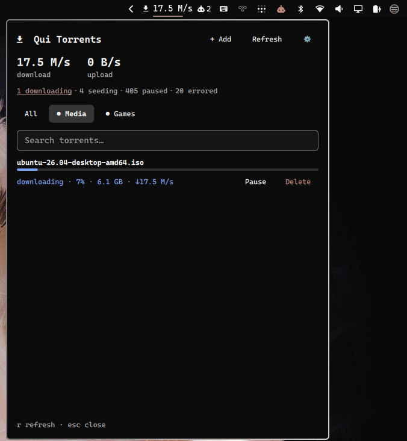
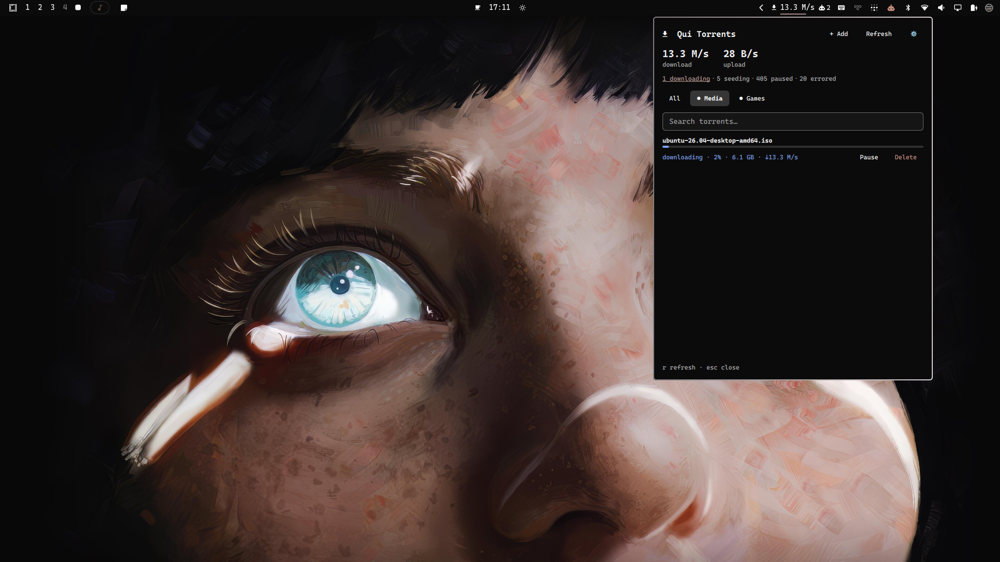

# Omarqui

An [Omarchy](https://omarchy.org/) bar widget for [Qui](https://github.com/autobrr/qui), the self-hosted qBittorrent management dashboard. See aggregate torrent speed and status at a glance, and manage torrents across all your qBittorrent instances without leaving the desktop.



### In the bar



## Features

- **Bar chip** — aggregate download speed across every qBittorrent instance Qui manages, with a tooltip summary
- **Status filters** — click "downloading / seeding / paused / errored" to filter the list
- **Instance filter** — switch between "All" and individual qBittorrent instances
- **Search** — filter by torrent name
- **Per-torrent actions** — pause, resume, delete (with a two-step confirm to avoid mistakes, and an option to delete the downloaded files too)
- **Add torrent** — paste a magnet link or a local `.torrent` file path, pick the instance and category, optionally start paused

## Requirements

- A running [Qui](https://github.com/autobrr/qui) instance
- A Qui API key (Settings → API Keys in the Qui web UI)

## Install

```bash
omarchy plugin add https://github.com/marcuspelo/omarqui.git
```

## Setup

1. Create `~/.config/omarqui/.env` with your Qui API key:
   ```
   API_KEY=your-qui-api-key
   ```
   Keeping the key in this file (outside the plugin folder) instead of `shell.json` keeps it out of any config you might sync or share.
2. Enable the widget and point it at your Qui instance:
   ```bash
   omarchy plugin enable marcuspelo.omarqui
   omarchy bar set marcuspelo.omarqui baseUrl "http://your-qui-host:7476"
   ```

## Configuration

Available settings (`shell.json`, or `omarchy bar set marcuspelo.omarqui <key> <value>`):

| Setting | Type | Default | Description |
|---|---|---|---|
| `baseUrl` | string | `http://localhost:7476` | Base URL of your Qui instance (no trailing slash) |
| `refreshIntervalSec` | integer | `10` | Seconds between background refreshes (5–300) |

## Keyboard shortcuts

| Key | Action |
|---|---|
| `r` | Refresh |
| `esc` | Close the panel |

## Remove

```bash
omarchy plugin remove marcuspelo.omarqui
```

## License

MIT
